  

  &nbsp;
  &nbsp;
  &nbsp;
  &nbsp;
  

  

<h2 align="center" id="about"><code>ABOUT</code></h2>

This GitHub space is a living portfolio of my data analytics journey where every repository reflects a real business problem explored through data-ranging from raw SQL queries and Excel models to interactive Power BI reports.

### What I'm up to?

My goal is to ensure people without a technical degree (Like me -_- ) can understand data well enough to confidently make better business decisions.

  

<h2 align="center" id="journey"><code>JOURNEY</code></h2>

  

<h2 align="center" id="toolkit"><code>TOOLKIT</code></h2>

  &nbsp;&nbsp;&nbsp;&nbsp;
  &nbsp;&nbsp;&nbsp;&nbsp;
  &nbsp;&nbsp;&nbsp;&nbsp;
  &nbsp;&nbsp;&nbsp;&nbsp;
  

  

<h2 align="center" id="featured-projects"><code>FEATURED PROJECTS</code></h2>
 

<table width="100%">
<tr>
<td width="50%" valign="top" align="left">
  <h3 align="center">Vrinda Store Sales Analysis</h3>
  

    
  

  
<em>Excel · Pivot Tables · Pivot Charts · Slicers</em>

  <ul>
    <li style="margin-bottom: 12px;"><strong>Brief:</strong> Leadership lacked visibility into channel profitability and regional sales due to uncleaned transaction data. I was brought in to map demographics and locate revenue leaks.</li>
    <li style="margin-bottom: 12px;"><strong>Strategy:</strong> Cleaned raw data and engineered dynamic pivot models to isolate performance across states, sales channels, and consumer demographics.</li>
    <li style="margin-bottom: 12px;"><strong>Outcome:</strong> Delivered an interactive Excel dashboard enabling stakeholders to instantly filter complex metrics and identify high-converting target markets.</li>
  </ul>
</td>
<td width="50%" valign="top" align="left">
  <h3 align="center">Music Store SQL Analysis</h3>
  

    
  

  
<em>MySQL · CTEs · Window Functions · RANK()</em>

  <ul>
    <li style="margin-bottom: 12px;"><strong>Brief:</strong> Operational data was siloed across the database. The business required an audit to uncover spending patterns and evaluate international catalog performance.</li>
    <li style="margin-bottom: 12px;"><strong>Strategy:</strong> Queried the live database using multi-table joins, CTEs, and window functions to resolve eleven critical business questions.</li>
    <li style="margin-bottom: 12px;"><strong>Outcome:</strong> Provided optimized SQL scripts surfacing immediate insights on top-performing genres, high-value customer segments, and global revenue trends.</li>
  </ul>
</td>
</tr>
<!-- Row containing aligned buttons -->
<tr>
<td width="50%" valign="bottom" align="center" style="padding-top: 20px;">
  
</td>
<td width="50%" valign="bottom" align="center" style="padding-top: 20px;">
  
</td>
</tr>
</table>

  

<h2 align="center" id="connect-with-me"><code>CONNECT WITH ME</code></h2>

 

  
  &nbsp;&nbsp;
  
  &nbsp;&nbsp;
  

 

  Kolkata, India

